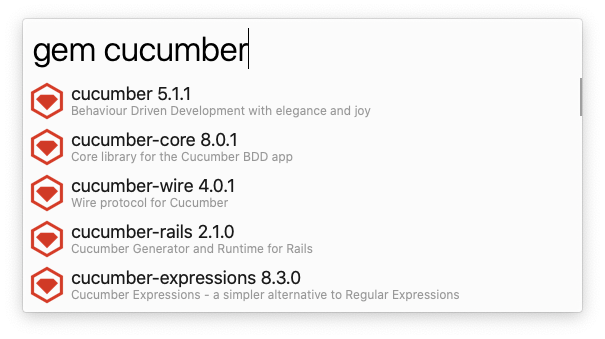

# search-rubygems

Search gem from [RubyGems.org][] workflow for [Alfred][].

## Installation

Download [.alfredworkflow](https://github.com/Sixeight/alfred-workflow-search-rubygems/releases) and double click it.

NOTE: You must allow the app to run.
See also: https://support.apple.com/en-us/HT202491

## Actions

| Modifier Key | Action                       |
|:--           |:--                           |
| -            | Open RubyGems.org page       |
| Cmd          | Open source code or homepage |
| Ctrl         | Open documentation           |

## Licence

[MIT](https://github.com/Sixeight/alfred-workflow-search-rubygems/blob/master/LICENSE)

## Author

[Sixeight](https://github.com/Sixeight)

[RubyGems.org]: https://rubygems.org
[Alfred]: https://www.alfredapp.com/
